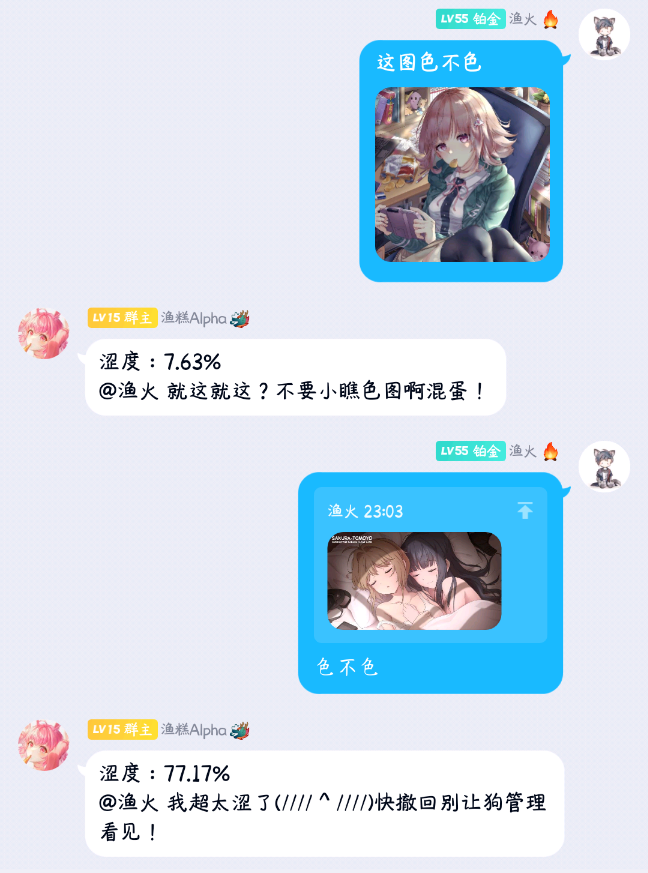

#### 此为Yunzai-Bot云崽QQ机器人的插件，需要依赖云崽机器人来实现功能
# 插件列表
* ### 原神角色语音合成（v2）（v3）
用于实现文字转语音。

 
 

* ### 搓新人头像（v3）
有人加群或退群时生成相应的头像表情包，**依赖[宵鸟py-plugin](https://gitee.com/realhuhu/py-plugin)的头像表情包模块**

 
 

* ### 涩图打分（v2）（v3）
用于评估群聊中图片的风险程度，提醒群员**撤回不良图片**，以**维持群内健康良好的风气**（

 
 

* ### 引用撤回（v2）（v3）
 1.主人：看到任意想要撤回的消息，对其回复“撤回”二字，即可撤回该条消息（若机器人不是管理员，则只能撤回机器人两分钟内的消息）
 2.群员：若机器人发了不当消息，群员可以对该消息回复“撤回”，即可让机器人撤回该条消息。群员仅能撤回机器人发出的消息。
 

 
 

## 使用方法
根据你的云崽版本下载对应版本插件，V2放进/lib/example文件夹，V3放进plugins/example文件夹
如何**下载单个插件**：点击"raw"（gitee中是“原始数据”）查看该插件源文件，将网页另存问即可；也可以点击copy代码，粘贴至本地.js文件中

 
 

### 其他
* [Yunzai-Bot](https://github.com/Le-niao/Yunzai-Bot)
* Yunzai-Bot插件库：[☞github](https://github.com/yhArcadia/Yunzai-Bot-plugins-index) [☞gitee](https://gitee.com/yhArcadia/Yunzai-Bot-plugins-index)
* Yunzai答疑和插件交流群：1170075637
* 渔糕就读的幼稚园：134086404  

